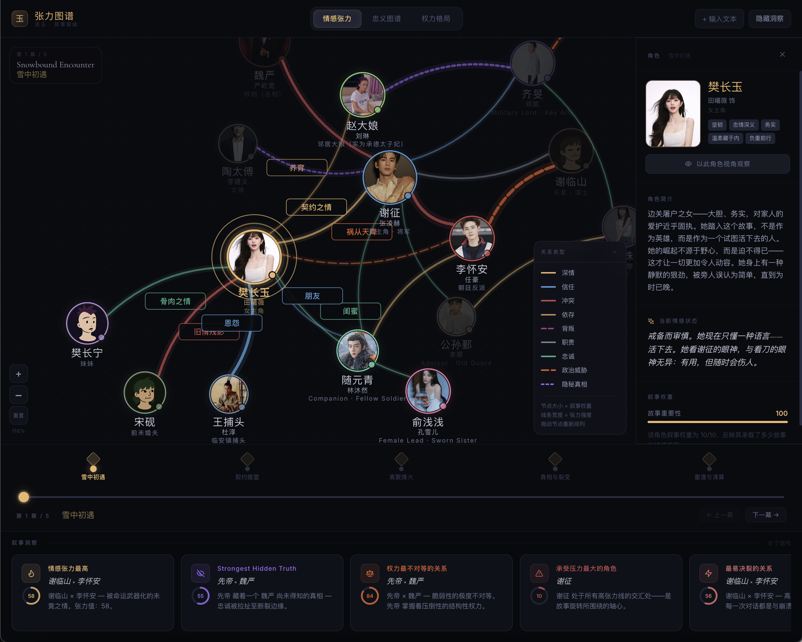
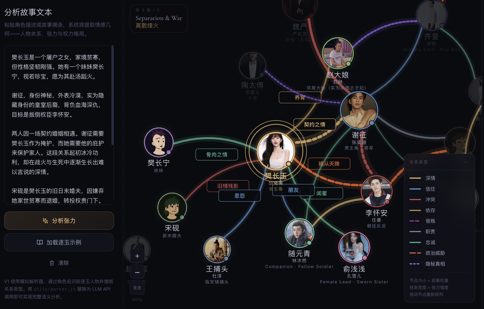
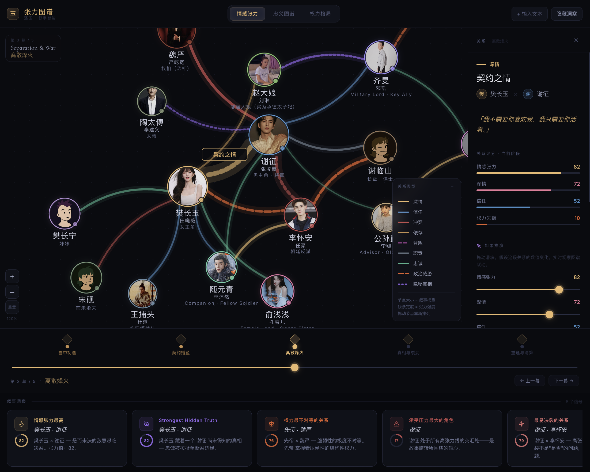

# 逐玉 · Tension Map

A cinematic narrative visualization app for the novel *逐玉* — exploring character relationships, emotional tension, loyalty, and power dynamics across five story stages.

## Screenshots







## Features

- **Interactive force-directed graph** — D3-powered character relationship visualization
- **3 analysis modes** — Emotional Tension (情感张力) · Loyalty Map (忠义图谱) · Power Dynamics (权力格局)
- **5 story stages** — Snowbound Encounter → Contract Marriage → Separation & War → Truth and Fracture → Reunion & Reckoning
- **Dynamic insight cards** — narrative analysis generated per stage and mode
- **Character detail panel** — click any node to explore individual arcs

## Tech Stack

React 18 · D3 v7 · Tailwind CSS v3 · Vite 5

## Getting Started

```bash
npm install
npm run dev
```

Open [http://localhost:5173](http://localhost:5173) in your browser.

## Build

```bash
npm run build
npm run preview
```
