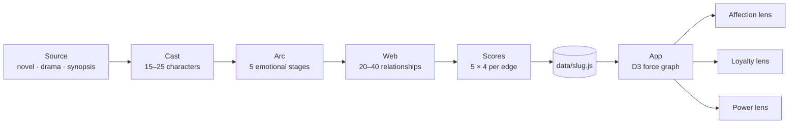

<!-- =============================================================== -->
<!--                                                                 -->
<!--   Tension Map · Narrative Intelligence for any story            -->
<!--                                                                 -->
<!-- =============================================================== -->

<div align="center">

<sub><strong>English</strong> · <a href="./README.zh-CN.md">中文</a></sub>

<br />
<br />

<h1>
  <span style="letter-spacing: 0.08em;">T</span>·<span style="letter-spacing: 0.08em;">E</span>·<span style="letter-spacing: 0.08em;">N</span>·<span style="letter-spacing: 0.08em;">S</span>·<span style="letter-spacing: 0.08em;">I</span>·<span style="letter-spacing: 0.08em;">O</span>·<span style="letter-spacing: 0.08em;">N</span>&nbsp;&nbsp;<span style="letter-spacing: 0.08em;">M</span>·<span style="letter-spacing: 0.08em;">A</span>·<span style="letter-spacing: 0.08em;">P</span>
  <br />
  <sub><sup>张力图谱</sup></sub>
</h1>

<p>
  <em>Visualize the emotional geometry of a story.</em>
</p>

<p>
  Plot the invisible forces between characters — affection, suspicion, loyalty,<br />
  betrayal, power, hidden truth. Watch bonds evolve as the arc unfolds.
</p>

<br />

<p>
  <a href="#-quick-start"></a>
  <a href="#-the-methodology"></a>
  <a href="#-bring-your-own-story"></a>
</p>

<p>
  
  
  
  
  
</p>

</div>

<br />

<p align="center">
  
</p>

<p align="center">
  <em>21 characters · 20+ relationships · 5 emotional stages · 3 analytical lenses</em>
</p>

---

## ✦ Why this exists

Most "character relationship diagrams" are wikis with arrows — flat, static, factual.

**A story isn't flat.** Trust erodes. Affection survives betrayal. Power flips. The same character who would die for you in chapter 3 is the one twisting the knife in chapter 9.

Tension Map treats a story as a **dynamic system**:

- Every character is a **node** with weight, traits, and a 5-stage emotional arc.
- Every relationship is an **edge** scored 0–100 across four axes — tension, trust, affection, power — and re-evaluated at each story stage.
- Three **analytical lenses** (Affection · Loyalty · Power) re-skin the same data to surface different truths.

The result is a graph that **breathes** with the story.

---

## ✦ Features

<table>
<tr>
<td width="50%" valign="top">

#### 🌐 Force-directed character graph
D3 v7 physics simulation. Click any node for a full character panel; any edge for relationship dynamics.

</td>
<td width="50%" valign="top">

#### 🎚 Three analytical modes
The same cast, three different stories:
- **Affection** — affection, conflict, dependence
- **Loyalty** — trust, loyalty, betrayal, duty
- **Power** — political threat, hidden truth, hierarchy

</td>
</tr>
<tr>
<td width="50%" valign="top">

#### 🎞 Five-stage timeline
Scrub through the arc — *encounter → contract → separation → fracture → reunion* — and watch bonds tighten, snap, and realign.

</td>
<td width="50%" valign="top">

#### 🪞 Perspective view
Pin any character and see the entire story refracted through *their* emotional lens.

</td>
</tr>
<tr>
<td width="50%" valign="top">

#### 🎛 What-if sandbox
Drag relationship scores. Adjacent edges propagate at 20% delta — small disturbances ripple through the network.

</td>
<td width="50%" valign="top">

#### 🔮 Generated narrative insights
Per-stage, per-mode insight cards: *most fractured bond · highest hidden tension · emotional center of the story…*

</td>
</tr>
</table>

---

## ✦ Screenshots

<table>
<tr>
<td width="33%"></td>
<td width="33%"></td>
<td width="33%"></td>
</tr>
<tr>
<td align="center"><sub>Character overview</sub></td>
<td align="center"><sub>Relationship detail</sub></td>
<td align="center"><sub>Bring your own story</sub></td>
</tr>
</table>

> The in-app UI is bilingual (English & Chinese). Mode labels render as *情感张力 · 忠义图谱 · 权力格局* alongside their English names.

---

## ✦ Quick start

```bash
git clone https://github.com/yanliudesign/tension-map.git
cd tension-map
npm install
npm run dev
```

Open [http://localhost:5173](http://localhost:5173).

```bash
npm run build      # production bundle
npm run preview    # preview the build locally
```

---

## ✦ How it works



The data layer is plain ES modules. The render layer is React + D3 + Tailwind. No backend, no database — everything runs client-side off the static dataset you load.

### The data model

```js
relationship = {
  id, source, target,
  primaryType: 'affection',
  types: ['affection', 'hidden_truth'],
  label: 'Bound by contract',
  labelEn: 'Bound by contract, forged in fire',
  quote: 'I don\'t need you to like me. I need you to stay alive.',
  summary, literaryNote,
  stages: {
    encounter:  { tensionScore: 32, trustScore: 12, affectionScore:  8, powerScore: 68 },
    contract:   { tensionScore: 55, trustScore: 28, affectionScore: 32, powerScore: 60 },
    separation: { tensionScore: 82, trustScore: 52, affectionScore: 72, powerScore: 45 },
    fracture:   { tensionScore: 97, trustScore:  8, affectionScore: 88, powerScore: 38 },
    reunion:    { tensionScore: 68, trustScore: 82, affectionScore: 92, powerScore: 50 },
  },
}
```

Each score is 0–100. Stages merge with any user "what-if" overrides at render time, and cascade 20% of the delta to adjacent edges.

---

## ✦ Bring your own story

The bundled dataset (`src/data/sampleData.js`) — a 21-character map of the Chinese palace drama *Zhuyu* — is the **first reference**. The graph engine itself is IP-agnostic. Feed it any story.

### Option A · Hand-write a dataset

Copy `sampleData.js` → `src/data/yourstory.js`, rewrite characters / relationships / stages.

```diff
// src/App.jsx
- import { characters, relationships, STAGES } from './data/sampleData'
+ import { characters, relationships, STAGES } from './data/yourstory'
```

`npm run dev` and you're in.

### Option B · Generate it with the `tension-map` skill

This repo is the **canonical renderer** of the [`tension-map`](https://github.com/yanliudesign) Claude / Copilot skill — a literary methodology for turning *any* novel or drama into a structured `data/{slug}.js` file.

In your AI agent of choice, just say:

> *"Build me a tension map for Nirvana in Fire."*

The skill walks you through: research → cast (15–25 characters) → arc (5 stages) → web (20–40 relationships) → scores → voice → assembled `src/data/{slug}.js`.

Then swap the import as in Option A.

> The skill lives outside this repo (in `~/.claude/skills/tension-map`). The data files it produces drop into `src/data/`.

---

## ✦ The methodology

Even without the agent skill, the methodology itself is portable. Every dataset is built on:

| Layer | Constraint | Why |
|---|---|---|
| **Cast** | 15–25 characters | Below 15 is thin; above 25 is visual noise that breaks the force layout |
| **Stages** | Exactly 5, each a *psychological* turning point — not a chapter | The Timeline UI is hard-locked to 5; arbitrary chapter slicing produces flat curves |
| **Edges** | 20–40 relationships | Sparse enough to read; dense enough to feel like a network |
| **Types** | 9 fixed types | `affection · trust · conflict · dependence · betrayal · duty · loyalty · political_threat · hidden_truth` |
| **Scores** | 4 dimensions × 5 stages × 0–100 | Calibrated against an anchor table so the curves *narrate* |
| **Voice** | Cinematic, em-dashes, no plot-summary tone | The text fields are not flavor — they're the literary surface |

These six constraints are what makes the visualization mean something. Strip any one and it collapses into a wiki.

---

## ✦ Tech stack

<table>
<tr>
<td valign="top">

**Core**
- React 18
- D3 v7 (force simulation + SVG)
- Tailwind CSS v3
- Vite 5
- lucide-react

</td>
<td valign="top">

**Visual language**
- Display · *Cormorant Garamond*
- Body · *Inter*
- Palette · Gold `#E8B86D` × Ink `#0E1014`
- Motion · floating, easing on every state change

</td>
</tr>
</table>

---

## ✦ Project structure

<details>
<summary><strong>Click to expand</strong></summary>

```
src/
├── App.jsx                  # Top-level state, hero intro, layout
├── main.jsx                 # React entry
├── index.css                # Tailwind layers + global styles
├── components/
│   ├── GraphCanvas.jsx      # D3 force simulation + SVG nodes/edges
│   ├── DetailPanel.jsx      # Side panel for selected node/edge
│   ├── Timeline.jsx         # 5-stage scrubber
│   ├── InsightCards.jsx     # Generated narrative analysis
│   ├── InputPanel.jsx       # Paste-your-own-story textarea
│   └── ModeToggle.jsx       # Affection / Loyalty / Power mode switcher
├── data/
│   ├── sampleData.js        # Zhuyu — the first reference dataset
│   └── {slug}.js            # add your own here
└── utils/
    ├── parser.js            # Rough text → graph parser
    └── insights.js          # Per-stage / per-mode narrative analysis
```

</details>

---

## ✦ Roadmap

- [x] 21-character force graph with three analytical modes
- [x] Five-stage timeline with score cascading
- [x] What-if sandbox with 20% delta propagation
- [x] Generated insight cards per stage × mode
- [x] Portable methodology packaged as `tension-map` skill
- [ ] In-app story switcher (drop the import-swap step)
- [ ] Real LLM call replacing the simulated `setTimeout` in `handleAnalyze`
- [ ] Export current view as SVG / PNG
- [ ] Animated transitions between stages (currently snap)
- [ ] Audio layer — a different motif per mode
- [ ] Additional reference datasets — *Nirvana in Fire · Joy of Life · Dream of the Red Chamber…*

Want to contribute a dataset? PR a `src/data/{slug}.js` and we'll feature it.

---

## ✦ Credits

<table>
<tr>
<td valign="top" width="60%">

**Story** · *Zhuyu (逐玉)*<br />
**Design & engineering** · [@yanliudesign](https://github.com/yanliudesign)<br />
**Methodology** · [`tension-map`](https://github.com/yanliudesign) Claude / Copilot skill<br />
**Built with** · React · D3 · Tailwind · Vite · Cormorant Garamond

</td>
<td valign="top" width="40%">

<sub>If this graph made you see the story differently, give it a ⭐.</sub>

</td>
</tr>
</table>

---

## ✦ License

MIT © 2026 [@yanliudesign](https://github.com/yanliudesign)

<div align="center"><br />

<sub>ink · gold · garamond</sub>

</div>
