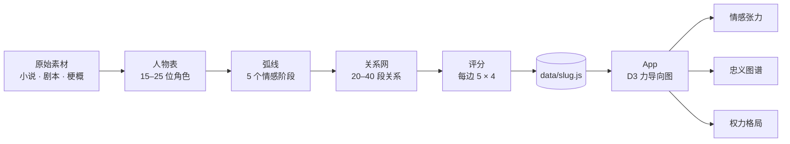

<!-- =============================================================== -->
<!--                                                                 -->
<!--   逐玉 · 张力图谱                                                -->
<!--   Tension Map · 任意故事的叙事智能                                -->
<!--                                                                 -->
<!-- =============================================================== -->

<div align="center">

<sub><a href="./README.md">English</a> · <strong>中文</strong></sub>

<br />
<br />

<h1>
  <span style="letter-spacing: 0.08em;">张</span>·<span style="letter-spacing: 0.08em;">力</span>·<span style="letter-spacing: 0.08em;">图</span>·<span style="letter-spacing: 0.08em;">谱</span>
  <br />
  <sub><sup>Tension Map</sup></sub>
</h1>

<p>
  <em>把一个故事的「情感几何」画出来。</em>
</p>

<p>
  绘制人物之间的隐形力量 —— 深情 · 猜忌 · 忠诚 · 背叛 · 权力 · 隐秘真相。<br />
  观察关系如何随剧情推进而演变。
</p>

<br />

<p>
  <a href="#-快速开始"></a>
  <a href="#-方法论"></a>
  <a href="#-用你自己的故事"></a>
</p>

<p>
  
  
  
  
  
</p>

</div>

<br />

<p align="center">
  
</p>

<p align="center">
  <em>21 位人物 · 20+ 段关系 · 5 个情感阶段 · 3 种分析视角</em>
</p>

---

## ✦ 为什么做这个

大部分"人物关系图"只是带箭头的 wiki —— 平的、静的、只罗列事实。

**故事不是平的。** 信任会侵蚀，深情可以撑过背叛，权力会翻面。第三章愿意为你去死的那个人，第九章可能正是握刀的那个。

`张力图谱` 把一个故事当作 **动态系统** 来处理：

- 每个角色是一个 **节点**，带权重、特质、五段情感弧线。
- 每段关系是一条 **连边**，沿四个轴各打 0–100 分 —— 张力、信任、深情、权力 —— 并在每个阶段重新评估。
- 三种 **分析视角**（情感张力 · 忠义图谱 · 权力格局）从同一份数据里翻出不同的真相。

最后得到的是一张 **会呼吸** 的图。

---

## ✦ 功能

<table>
<tr>
<td width="50%" valign="top">

#### 🌐 力导向人物图
D3 v7 物理模拟。点节点看人物面板，点连边看关系动态。

</td>
<td width="50%" valign="top">

#### 🎚 三种分析模式
同样的 21 个人，三种不同的故事：
- **情感张力** —— 深情、冲突、依存
- **忠义图谱** —— 信任、忠诚、背叛、责任
- **权力格局** —— 政敌、隐秘真相、阶层

</td>
</tr>
<tr>
<td width="50%" valign="top">

#### 🎞 五阶段时间轴
拖动滑块横扫整条弧线 —— *雪中初遇 → 契约同行 → 离散烽火 → 真相崩塌 → 重逢与释怀* —— 看羁绊如何收紧、断裂、再次缝合。

</td>
<td width="50%" valign="top">

#### 🪞 视角模式
钉住任意一个角色，让整个故事从 *他* 的情感折射回来。

</td>
</tr>
<tr>
<td width="50%" valign="top">

#### 🎛 What-if 沙盒
拖动关系分数。相邻边以 20% delta 传播 —— 一点小扰动会在网络里扩散。

</td>
<td width="50%" valign="top">

#### 🔮 自动生成的叙事洞察
按阶段、按模式生成卡片：*最破裂的羁绊 · 最高隐秘张力 · 故事的情感重心……*

</td>
</tr>
</table>

---

## ✦ 截图

<table>
<tr>
<td width="33%"></td>
<td width="33%"></td>
<td width="33%"></td>
</tr>
<tr>
<td align="center"><sub>人物概览 · 雪中初遇</sub></td>
<td align="center"><sub>关系详情 · 离散烽火</sub></td>
<td align="center"><sub>用你自己的故事</sub></td>
</tr>
</table>

---

## ✦ 快速开始

```bash
git clone https://github.com/yanliudesign/tension-map.git
cd tension-map
npm install
npm run dev
```

打开 [http://localhost:5173](http://localhost:5173)。

```bash
npm run build      # 生产构建
npm run preview    # 本地预览构建结果
```

---

## ✦ 工作原理



数据层是普通 ES 模块。渲染层是 React + D3 + Tailwind。没有后端、没有数据库 —— 一切都在客户端从你加载的静态数据集里跑出来。

### 数据模型

```js
relationship = {
  id, source, target,
  primaryType: 'affection',
  types: ['affection', 'hidden_truth'],
  label: '契约之情', labelEn: 'Bound by contract, forged in fire',
  quote: '我不需要你喜欢我，我只需要你活着。',
  summary, literaryNote,
  stages: {
    encounter:  { tensionScore: 32, trustScore: 12, affectionScore:  8, powerScore: 68 },
    contract:   { tensionScore: 55, trustScore: 28, affectionScore: 32, powerScore: 60 },
    separation: { tensionScore: 82, trustScore: 52, affectionScore: 72, powerScore: 45 },
    fracture:   { tensionScore: 97, trustScore:  8, affectionScore: 88, powerScore: 38 },
    reunion:    { tensionScore: 68, trustScore: 82, affectionScore: 92, powerScore: 50 },
  },
}
```

每个分数都是 0–100。渲染时各阶段会与用户的 "what-if" 覆盖合并，并向相邻边级联 20% 的差值。

---

## ✦ 用你自己的故事

逐玉数据集（`src/data/sampleData.js`）是 **首份参考**。图引擎本身与 IP 无关 —— 喂什么故事都可以。

### 方案 A · 手写数据集

复制 `sampleData.js` → `src/data/yourstory.js`，重写人物 / 关系 / 阶段。

```diff
// src/App.jsx
- import { characters, relationships, STAGES } from './data/sampleData'
+ import { characters, relationships, STAGES } from './data/yourstory'
```

`npm run dev`，搞定。

### 方案 B · 用 `tension-map` skill 自动生成

这个 repo 是 [`tension-map`](https://github.com/yanliudesign) Claude / Copilot skill 的 **官方渲染器** —— 一套把 *任意* 小说 / 剧集 转成结构化 `data/{slug}.js` 文件的文学方法论。

在你常用的 AI agent 里直接说：

> 帮我做《琅琊榜》的张力图谱

Skill 会带着你走完：素材调研 → 人物表（15–25 位）→ 弧线（5 阶段）→ 关系网（20–40 段）→ 评分 → 文学口吻 → 装配 `src/data/langyabang.js`。

然后按方案 A 换一下 import 就行。

> Skill 装在 repo 外（`~/.claude/skills/tension-map`）。它产出的数据文件落到本仓库的 `src/data/`。

---

## ✦ 方法论

哪怕不用 skill，方法论本身也可以独立带走。每一份数据集都建立在六条硬约束之上：

| 层 | 约束 | 为什么 |
|---|---|---|
| **人物表** | 15–25 位 | 少于 15 太薄；多于 25 视觉嘈杂，会撑爆力导向布局 |
| **阶段** | 严格 5 个，每个是 *心理* 转折点 —— 不是章节 | Timeline UI 硬锁 5 段；按章节随便切会让曲线变平 |
| **连边** | 20–40 段关系 | 稀到能读，密到像网 |
| **类型** | 9 种固定 | `affection · trust · conflict · dependence · betrayal · duty · loyalty · political_threat · hidden_truth` |
| **评分** | 4 维 × 5 阶段 × 0–100 | 对着锚点表打分，曲线本身就在 *讲故事* |
| **文学口吻** | 电影感、破折号、不剧透梗概腔 | 文案不是装饰，是文学表层 |

这六条是让可视化有意义的关键。少掉任何一条，它就塌成一份 wiki。

---

## ✦ 技术栈

<table>
<tr>
<td valign="top">

**核心**
- React 18
- D3 v7（力导向 + SVG）
- Tailwind CSS v3
- Vite 5
- lucide-react

</td>
<td valign="top">

**视觉语言**
- 标题字 · *Cormorant Garamond*
- 正文字 · *Inter*
- 配色 · 金 `#E8B86D` × 墨 `#0E1014`
- 动效 · 漂浮、缓动，每次状态变化都带过渡

</td>
</tr>
</table>

---

## ✦ 项目结构

<details>
<summary><strong>展开查看</strong></summary>

```
src/
├── App.jsx                  # 顶层状态、序章、布局
├── main.jsx                 # React 入口
├── index.css                # Tailwind layers + 全局样式
├── components/
│   ├── GraphCanvas.jsx      # D3 力导向 + SVG 节点/边
│   ├── DetailPanel.jsx      # 选中节点/边的侧面板
│   ├── Timeline.jsx         # 5 段时间轴
│   ├── InsightCards.jsx     # 自动生成的叙事分析
│   ├── InputPanel.jsx       # 粘贴你自己故事的输入框
│   └── ModeToggle.jsx       # 情感 / 忠义 / 权力 模式切换
├── data/
│   ├── sampleData.js        # 逐玉 —— 首份参考数据集
│   └── {slug}.js            # 你自己的数据集放这
└── utils/
    ├── parser.js            # 粗略的文本 → 图解析
    └── insights.js          # 按阶段/按模式的叙事分析
```

</details>

---

## ✦ 路线图

- [x] 21 人物力导向图 + 三种分析模式
- [x] 5 段时间轴 + 评分级联
- [x] What-if 沙盒，20% delta 传播
- [x] 每个阶段 × 模式的自动洞察卡
- [x] 方法论封装成 `tension-map` skill
- [ ] App 内故事切换器（省掉换 import 这一步）
- [ ] 把 `handleAnalyze` 里的 `setTimeout` 换成真正的 LLM 调用
- [ ] 当前视图导出为 SVG / PNG
- [ ] 阶段之间的动画过渡（目前是瞬切）
- [ ] 音频层 —— 每种模式一段不同的旋律动机
- [ ] 更多参考数据集 —— *琅琊榜 · 庆余年 · 红楼梦*……

想贡献一份数据集？发 PR 把 `src/data/{slug}.js` 提上来，会精选展示。

---

## ✦ 致谢

<table>
<tr>
<td valign="top" width="60%">

**原作** · 《逐玉》<br />
**设计与工程** · [@yanliudesign](https://github.com/yanliudesign)<br />
**方法论** · [`tension-map`](https://github.com/yanliudesign) Claude / Copilot skill<br />
**Built with** · React · D3 · Tailwind · Vite · Cormorant Garamond

</td>
<td valign="top" width="40%">

<sub>如果这张图让你换了一种眼光看这个故事，请点一颗 ⭐。</sub>

</td>
</tr>
</table>

---

## ✦ License

MIT © 2026 [@yanliudesign](https://github.com/yanliudesign)

<div align="center"><br />

<sub>玉 · 墨 · 金 · garamond</sub>

</div>
